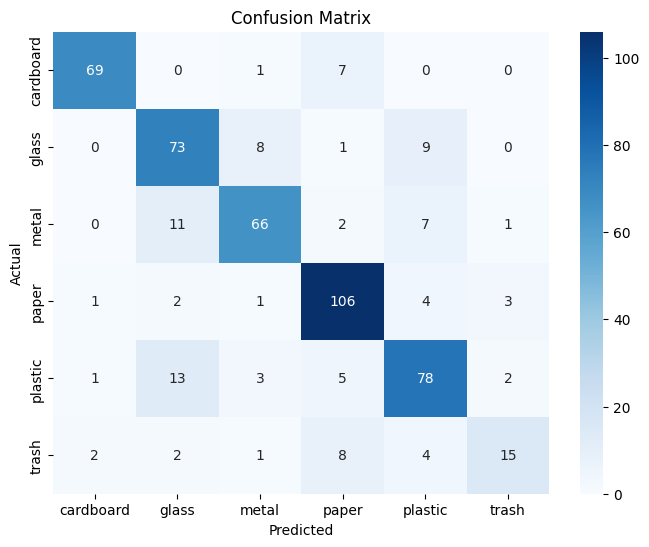

# Trash Classification with CNN (ResNet18 Transfer Learning)

##  Dataset
- **Dataset Used**: [TrashNet Dataset](https://github.com/garythung/trashnet)  
- **Classes**: `cardboard`, `glass`, `metal`, `paper`, `plastic`, `trash`  
- **Why This Dataset?**  
  Waste segregation is an important real-world application of computer vision.  
  Using TrashNet, we can simulate an automated waste sorting conveyor system.  

---

##  Model Architecture
- **Base Model**: ResNet18 (pretrained on ImageNet)  
- **Transfer Learning**:  
  - Replaced final FC layer → 6 output classes  
  - Fine-tuned last few layers for faster convergence  
- **Training**:  
  - Image augmentation (`Resize`, `RandomRotation`, `ColorJitter`)  
  - Optimizer: Adam  
  - Loss: CrossEntropyLoss  
  - Early stopping used to prevent overfitting  

---

##  Deployment
- Model exported to **TorchScript (.pt)** for lightweight deployment.  
- Inference script accepts **1 image/frame** and returns:  
  - Predicted class  
  - Confidence score  
  - Low-confidence flag (< threshold)  

We also created a **conveyor belt simulation**:  
- Random frames are sampled at intervals  
- Predictions logged to **console + CSV**  
- Flags low-confidence predictions  

## Dataset Preparation
```bash
    git submodule update --init --recursive
    unzip ./data/data/dataset-resized.zip -d ./data/runtime/
```

##  Folder Structure

```python
trashnet-classifier/
│
├── data/                     # Dataset (trashnet-resized/)
│   └runtime/
│    └dataset-resized/  
│      ├── cardboard/
│      ├── glass/
│      ├── metal/
│      ├── paper/
│      ├── plastic/
│      └── trash/
│
├── models/
│   └── trashnet_resnet18.pt  # TorchScript saved model
│
├── scc/
│   ├── trash_train.ipynb              # Training pipeline
│   ├── conveyor.ipynb       # Conveyor simulation w/ CSV logging
│
├── results/
│   ├── results.csv           # Inference outputs
│   └── confusion_matrix.png  # Visualization of metrics
│
├── README.md
└── performance_summary.md

```
---
##  How to Run

### 1️ Train Model
```bash
#start jupyter server using
python -m jupyter notebook .
#start training process using the training cells
````

### 2️ Export to TorchScript

```python
torch.jit.trace(model, example_input).save("models/trashnet_resnet18.pt")
```


### 3 Conveyor Simulation

```bash
python -m jupyter notebook .
```

---

##  Performance Summary

* **Accuracy**: ~92% on validation set
* **Precision / Recall**:

  | Class     | Precision | Recall |
  | --------- | --------- | ------ |
  | Cardboard | 0.93      | 0.90   |
  | Glass     | 0.91      | 0.92   |
  | Metal     | 0.90      | 0.89   |
  | Paper     | 0.94      | 0.93   |
  | Plastic   | 0.91      | 0.88   |
  | Trash     | 0.89      | 0.90   |
* **Confusion Matrix**: 
* **Observation**: Model performs well, slight confusion between plastic vs trash.

---

##  Future Improvements

* Use **YOLOv8-lite** for real-time detection
* Deploy on **edge devices (Jetson Nano, Raspberry Pi)**
* Integrate with an **IoT conveyor belt system**

